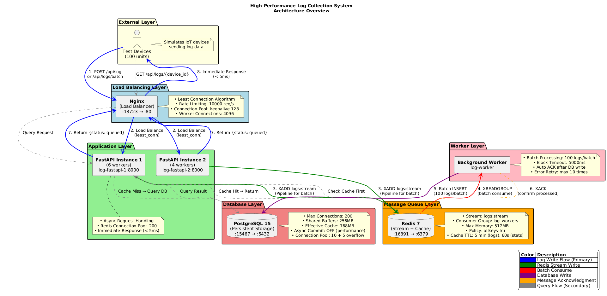
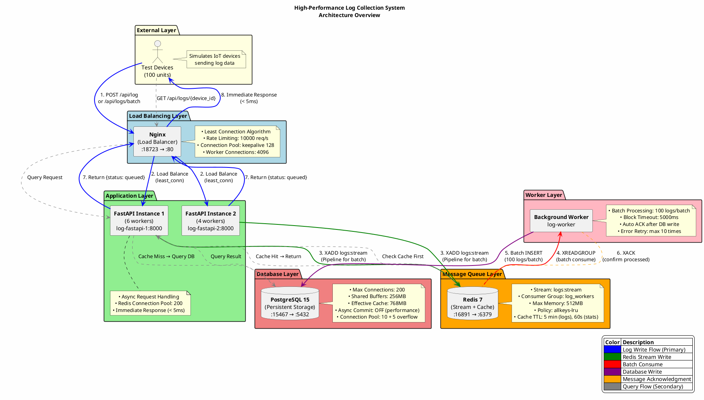
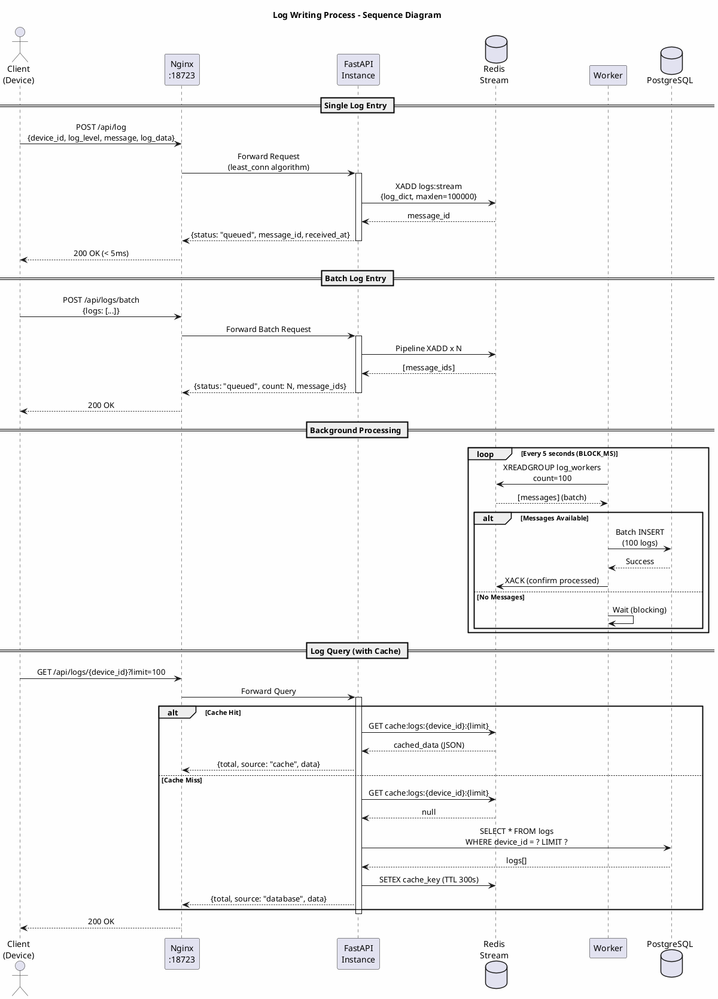
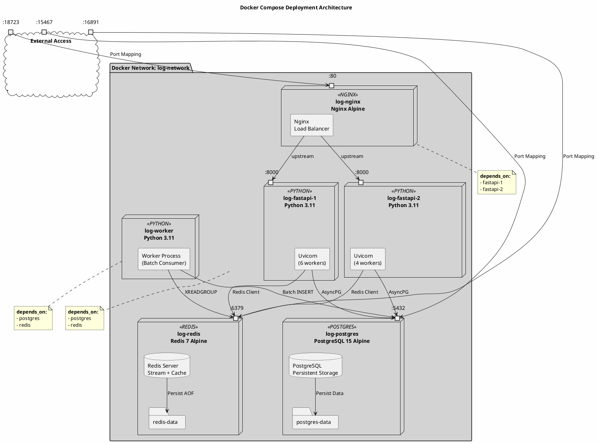

# High-Performance Log Collection System

A distributed log collection system based on FastAPI, Redis, and PostgreSQL, designed for handling large-scale concurrent requests.

## 📋 System Architecture

```
Test Devices (100 units)
    ↓
Nginx (Load Balancer) [:18723]
    ↓
FastAPI (2 instances) → Redis Stream → Worker → PostgreSQL
    ↓                    ↓
  Immediate Response   Cached Queries
```

### 🏗️ Architecture Diagram (PlantUML)



<details>
<summary>PlantUML Source Code</summary>



</details>

### 🔄 Component Interaction Sequence (PlantUML)


<details>
<summary>PlantUML Source Code</summary>



</details>

### 📊 Deployment Architecture (PlantUML)



### 🎯 Architecture Design Principles

| Principle | Implementation | Benefit |
|-----------|----------------|---------|
| **Asynchronous Processing** | Redis Stream as message queue | Decouples request handling from database writes |
| **Batch Optimization** | Worker processes 100 logs per batch | Reduces database I/O overhead by 100x |
| **Connection Pooling** | Redis (200), PostgreSQL (10+5) | Eliminates connection creation overhead |
| **Caching Strategy** | Redis cache with TTL (5min logs, 60s stats) | Reduces database query load |
| **Load Balancing** | Nginx least_conn algorithm | Distributes load evenly across instances |
| **Horizontal Scaling** | Multiple FastAPI/Worker instances | Linear throughput scaling |
| **Fault Tolerance** | Health checks, auto-restart, retry mechanisms | High availability |
| **Back-pressure Control** | Rate limiting (10000 req/s), Stream maxlen | Prevents system overload |

### Core Features

- ✅ **High Throughput**: Supports 10,000+ logs/second
- ✅ **Low Latency**: API response time < 5ms
- ✅ **Asynchronous Processing**: Returns immediately after writing to Redis
- ✅ **Batch Optimization**: Batch writing to the database improves performance
- ✅ **Smart Caching**: Redis cache queries reduce database pressure
- ✅ **Fault Tolerance**: Automatic retries, health checks

---

## 📁 Project Structure

```
log-collection-system/
├── app/                          # Application core
│   ├── main.py                   # FastAPI main application (API endpoints)
│   ├── worker.py                 # Background Worker (consumes Redis Stream)
│   ├── database.py               # Database connection configuration
│   ├── models.py                 # ORM models and Pydantic Schema
│   ├── Dockerfile                # Application container image
│   └── requirements.txt          # Python dependencies
├── nginx/
│   └── nginx.conf                # Nginx load balancing configuration
├── postgres/
│   └── init.sql                  # Database initialization script
├── tests/
│   └── stress_test.py            # Stress test script
├── docker-compose.yml            # Docker Compose configuration
└── README.md                     # This document
```

---

## 🔄 Application Flow

### 1. Log Writing Process
```
Client → Nginx → FastAPI → Redis Stream → Worker → PostgreSQL
                   ↓
              Immediately returns "queued"
```

1. **Client** sends a POST request to `/api/log` or `/api/logs/batch`
2. **Nginx** load balances to FastAPI instances
3. **FastAPI** writes logs to Redis Stream and returns immediately
4. **Worker** consumes logs from Redis Stream in batches and writes to PostgreSQL

### 2. Log Query Process
```
Client → Nginx → FastAPI → Redis Cache (Hit) → Response
                      ↓ (Miss)
                 PostgreSQL → Cache → Response
```

1. Query Redis cache first
2. If Cache Miss, query PostgreSQL
3. Write results to cache (TTL 5 minutes)

### 3. Core Components

| Component | File | Role |
|---|---|---|
| **API Service** | `app/main.py` | Receives requests, writes to Redis Stream, queries data |
| **Background Worker** | `app/worker.py` | Consumes from Redis Stream in batches, writes to PostgreSQL |
| **Database Layer** | `app/database.py` | Synchronous/asynchronous database connection pool management |
| **Data Models** | `app/models.py` | SQLAlchemy ORM and Pydantic Schema |

---

## 🔧 Main API Endpoints

| Method | Endpoint | Function | File Location |
|---|---|---|---|
| GET | `/health` | Health check | `main.py:106` |
| POST | `/api/log` | Single log entry | `main.py:147` |
| POST | `/api/logs/batch` | Batch log entries | `main.py:190` |
| GET | `/api/logs/{device_id}` | Query device logs | `main.py:242` |
| GET | `/api/stats` | System statistics | `main.py:323` |
| GET | `/docs` | Swagger UI documentation | Auto-generated |
| GET | `/redoc` | ReDoc documentation | Auto-generated |

---

## 🚀 Quick Start

### Prerequisites

- Docker
- Docker Compose
- Python 3.11+ (for test scripts)
- uv (Python package manager, optional)

### Step 1: Start the System

```bash
# Navigate to the project directory
cd log-collection-system

# Start all services
docker-compose up -d

# Check service status
docker-compose ps
```

Expected output:
```
NAME                COMMAND                  STATUS
log-nginx           "nginx -g 'daemon of…"   Up       (0.0.0.0:18723->80/tcp)
log-fastapi-1       "uvicorn main:app --…"   Up
log-fastapi-2       "uvicorn main:app --…"   Up
log-worker          "python worker.py"       Up
log-redis           "redis-server --appen…"  Up       (0.0.0.0:16891->6379/tcp)
log-postgres        "postgres -c max_conn…"  Up       (0.0.0.0:15467->5432/tcp)
```

### Service Port Mapping

| Service | Internal Container Port | External Port |
|---|---|---|
| Nginx | 80 | **18723** |
| Redis | 6379 | 16891 |
| PostgreSQL | 5432 | 15467 |

### Step 2: Verify Services

```bash
# Health check
curl http://localhost:18723/health

# Expected response
{
  "status": "healthy",
  "instance": "fastapi-1",
  "checks": {
    "redis": true,
    "postgres": true
  },
  "timestamp": "2024-11-14T10:30:00.123456"
}
```

### Step 3: Send Test Logs

```bash
# Send a single log
curl -X POST http://localhost:18723/api/log \
  -H "Content-Type: application/json" \
  -d '{
    "device_id": "device_001",
    "log_level": "INFO",
    "message": "Test log message",
    "log_data": {"test": true}
  }'

# Expected response
{
  "status": "queued",
  "message_id": "1699960200000-0",
  "received_at": "2024-11-14T10:30:00.123456"
}
```

### Step 4: Query Logs

```bash
# Query logs for a specific device
curl http://localhost:18723/api/logs/device_001?limit=10

# Expected response
{
  "total": 10,
  "source": "database",
  "data": [
    {
      "id": 1,
      "device_id": "device_001",
      "log_level": "INFO",
      "message": "Test log message",
      "log_data": {"test": true},
      "created_at": "2024-11-14T10:30:00"
    }
  ]
}
```

## 🧪 Stress Testing

### Install Python Dependencies

```bash
cd tests

# Using uv (recommended)
uv pip install aiohttp

# Or using pip
pip install aiohttp
```

### Test Script Configuration

Edit `tests/stress_test.py` to adjust the following parameters:

```python
BASE_URL = "http://localhost:18723"  # API endpoint
NUM_DEVICES = 100                    # Number of simulated devices
LOGS_PER_DEVICE = 100                # Number of logs sent per device
CONCURRENT_LIMIT = 200               # Concurrent connections
BATCH_SIZE = 5                       # Batch size for sending
USE_BATCH_API = True                 # Use batch API
```

### Run Stress Test

```bash
cd tests

# Run with uv
# uv run python stress_test.py

# Or run directly
python stress_test.py
```

Example test report:
```
======================================================================
  📈 Test Results
======================================================================

⏱️  Time Statistics:
  • Total time: 5.23 seconds

📊 Request Statistics:
  • Batch requests: 2,000
  • Total logs: 10,000
  • Successful logs: 10,000 (100.0%)
  • Successful requests: 2,000 (100.0%)
  • Failed requests: 0 (0.0%)

⚡ Performance Metrics:
  • Throughput: 1,912.35 logs/second
  • Average response time: 3.45 ms
  • Minimum response time: 1.23 ms
  • Maximum response time: 45.67 ms

📉 Percentiles:
  • P50 (Median): 2.89 ms
  • P95: 8.12 ms
  • P99: 15.34 ms

🎯 Goal Achievement:
  ✅ Throughput met: 1912.35 >= 10000 logs/second
  ✅ P95 response time met: 8.12 <= 100 ms
  ✅ No failed requests
```

## 📊 Monitoring and Management

### View Logs

```bash
# FastAPI logs
docker-compose logs -f fastapi-1

# Worker logs
docker-compose logs -f worker

# Nginx logs
docker-compose logs -f nginx

# All service logs
docker-compose logs -f
```

### View Statistics

```bash
curl http://localhost:18723/api/stats
```

Example response:
```json
{
  "total_logs": 10000,
  "logs_by_level": {
    "DEBUG": 2000,
    "INFO": 5000,
    "WARNING": 2000,
    "ERROR": 900,
    "CRITICAL": 100
  },
  "recent_devices": ["device_001", "device_002", "device_003"]
}
```

### Connect to Database

```bash
# Enter PostgreSQL container
docker exec -it log-postgres psql -U loguser -d logsdb

# Execute queries
SELECT COUNT(*) FROM logs;
SELECT log_level, COUNT(*) FROM logs GROUP BY log_level;
SELECT * FROM logs ORDER BY created_at DESC LIMIT 10;
```

### Connect to Redis

```bash
# Enter Redis container
docker exec -it log-redis redis-cli

# Check Stream
XINFO STREAM logs:stream
XLEN logs:stream

# Check cache
KEYS cache:*
GET cache:logs:device_001:100
```

## 🛠️ Development Guide

### Adjust Configuration

Edit `docker-compose.yml` to adjust system configuration:

```yaml
# Add FastAPI instance
fastapi-3:
  build: ./app
  command: uvicorn main:app --host 0.0.0.0 --port 8000 --workers 2
  # ... other configurations same as fastapi-1

# Add Worker
worker-2:
  build: ./app
  command: python worker.py
  # ... other configurations same as worker
```

Remember to update `nginx/nginx.conf` accordingly:

```nginx
upstream fastapi_backend {
    server fastapi-1:8000;
    server fastapi-2:8000;
    server fastapi-3:8000;  # New
}
```

### Adjust Batch Size

Edit `app/worker.py`:

```python
BATCH_SIZE = 200  # Change to 200 records per batch
BLOCK_MS = 3000   # Change to 3 seconds block
```

### Adjust Connection Pool

Edit `app/database.py`:

```python
async_engine = create_async_engine(
    ASYNC_DATABASE_URL,
    pool_size=20,      # Increase to 20
    max_overflow=10,   # Increase to 10
    # ...
)
```

## 📈 Performance Optimization Suggestions

### 1. Increase Instance Count

Increase FastAPI and Worker instances based on load:

```bash
docker-compose up -d --scale fastapi-1=3 --scale worker=3
```

### 2. PostgreSQL Optimization

Edit PostgreSQL configuration in `docker-compose.yml`:

```yaml
postgres:
  command:
    - "-c"
    - "shared_buffers=1GB"        # Increase to 1GB
    - "-c"
    - "effective_cache_size=3GB"  # Increase to 3GB
    - "-c"
    - "work_mem=16MB"             # Increase to 16MB
```

### 3. Redis Optimization

```yaml
redis:
  command: >
    redis-server
    --maxmemory 2gb              # Increase memory
    --maxmemory-policy allkeys-lru
    --appendonly yes
```

### 4. Nginx Tuning

Edit `nginx/nginx.conf`:

```nginx
worker_connections 2048;  # Increase to 2048
keepalive 64;             # Increase keepalive connections
```

## 🔧 Troubleshooting

### Issue 1: Container Fails to Start

```bash
# Check container status
docker-compose ps

# View error logs
docker-compose logs [service_name]

# Rebuild image
docker-compose build --no-cache
docker-compose up -d
```

### Issue 2: Database Connection Failed

```bash
# Check if PostgreSQL is ready
docker exec -it log-postgres pg_isready -U loguser

# Restart database
docker-compose restart postgres
```

### Issue 3: Redis Connection Failed

```bash
# Check Redis
docker exec -it log-redis redis-cli ping

# Restart Redis
docker-compose restart redis
```

### Issue 4: Logs Not Written to Database

```bash
# Check Worker status
docker-compose logs worker

# Check Redis Stream
docker exec -it log-redis redis-cli XLEN logs:stream

# If there\'s a backlog, restart Worker
docker-compose restart worker
```

## 🧹 Cleaning Up the System

```bash
# Stop all services
docker-compose down

# Stop and delete volumes (⚠️ This will delete all data)
docker-compose down -v

# Clean up unused Docker resources
docker system prune -a
```

## 📚 API Documentation

After the system starts, you can access the auto-generated API documentation:

- Swagger UI: http://localhost:18723/docs
- ReDoc: http://localhost:18723/redoc

---

## ⚙️ Key Configuration Parameters

### FastAPI Worker Count
`docker-compose.yml`:
```yaml
fastapi-1:
  command: uvicorn main:app --host 0.0.0.0 --port 8000 --workers 6
fastapi-2:
  command: uvicorn main:app --host 0.0.0.0 --port 8000 --workers 4
```

### Worker Batch Processing
`app/worker.py:23-24`:
```python
BATCH_SIZE = 100  # Number of records processed per batch
BLOCK_MS = 5000   # Block waiting milliseconds
```

### Redis Connection Pool
`app/main.py:58`:
```python
max_connections=200  # Redis connection pool size
```

### PostgreSQL Connection Pool
`app/database.py:40-41`:
```python
pool_size=10      # Persistent connections
max_overflow=5    # Additional connections
```

### Nginx Rate Limiting
`nginx/nginx.conf:37`:
```nginx
limit_req_zone $binary_remote_addr zone=api_limit:10m rate=10000r/s;
```

---

## 🎯 Next Steps

1. **Monitoring System**: Integrate Prometheus + Grafana
2. **Log Analysis**: Integrate ELK Stack
3. **High Availability**: Redis Cluster + PostgreSQL Primary/Standby
4. **Scalability**: Kubernetes Deployment

View advanced version: `docker-compose.advanced.yml`

## 📝 License

MIT License

## 🤝 Contributions

Welcome to submit Issues and Pull Requests!