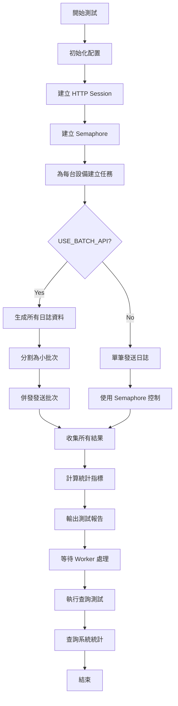

# 壓力測試腳本文件

## 概述

`tests/stress_test.py` 是一個高效能日誌收集系統的壓力測試工具，用於模擬大量設備併發發送日誌，評估系統的吞吐量、延遲和穩定性。

---

## 架構概覽

```
┌─────────────────┐
│   stress_test   │
│    (Client)     │
└────────┬────────┘
         │
         │ HTTP POST (aiohttp)
         │ Concurrent: 200
         ▼
┌─────────────────┐
│     Nginx       │
│  (Port 18723)   │
└────────┬────────┘
         │
         ▼
┌─────────────────┐
│    FastAPI      │
│  /api/logs/batch│
└─────────────────┘
```

---

## 測試配置參數

| 參數 | 預設值 | 說明 |
|------|--------|------|
| `BASE_URL` | `http://localhost:18723` | API 端點（Nginx 反向代理） |
| `NUM_DEVICES` | 100 | 模擬設備數量 |
| `LOGS_PER_DEVICE` | 100 | 每台設備發送的日誌數 |
| `CONCURRENT_LIMIT` | 200 | 最大併發請求數 |
| `BATCH_SIZE` | 5 | 每批次包含的日誌數 |
| `USE_BATCH_API` | True | 啟用批量 API 模式 |

**總計日誌量**: 100 設備 × 100 日誌 = **10,000 筆日誌**

---

## 程式碼結構

### 1. 模組導入區塊 (Line 1-9)
```python
import asyncio      # 非同步 I/O
import aiohttp      # 非同步 HTTP 客戶端
import time         # 計時功能
import random       # 隨機數生成
from datetime import datetime
from typing import List
```

### 2. 測試配置區塊 (Line 11-39)
定義測試參數和模擬資料：
- 日誌等級：`DEBUG`, `INFO`, `WARNING`, `ERROR`, `CRITICAL`
- 訊息模板：10 種不同的系統狀態訊息

### 3. 核心函數

#### `generate_log_data()` (Line 44-69)
**功能**：生成隨機日誌資料

```python
def generate_log_data(device_id: str, log_num: int) -> dict:
    return {
        "device_id": device_id,
        "log_level": random.choice(LOG_LEVELS),
        "message": "動態訊息",
        "log_data": {
            "test_id": log_num,
            "timestamp": datetime.now().isoformat(),
            "random_value": random.random(),
            "sequence": log_num
        }
    }
```

#### `send_log()` (Line 74-127)
**功能**：發送單筆日誌（非批量模式）
- 端點：`POST /api/log`
- 超時：10 秒
- 回傳：成功/失敗狀態、回應時間、錯誤訊息

#### `send_batch_logs()` (Line 132-186)
**功能**：批量發送日誌（高效能模式）
- 端點：`POST /api/logs/batch`
- 超時：30 秒
- 回傳：包含批次日誌數量的結果

#### `batch_send_logs()` (Line 191-221)
**功能**：控制單一設備的日誌發送策略
- 使用 `asyncio.Semaphore` 控制併發
- 支援批量/單筆兩種模式
- 自動分割大批次為小批次

#### `stress_test()` (Line 226-373)
**功能**：主要壓力測試邏輯
- 建立併發控制
- 為每台設備建立非同步任務
- 統計效能指標
- 評估目標達成情況

#### `query_test()` (Line 378-400)
**功能**：測試查詢 API
- 端點：`GET /api/logs/{device_id}?limit=10`
- 驗證資料寫入成功

---

## 測試執行流程



### 詳細流程說明

1. **初始化階段**
   - 載入測試配置
   - 建立 `asyncio.Semaphore(200)` 控制併發
   - 建立 `aiohttp.TCPConnector` 連線池

---

## 初始化階段深入解析

### 1. 載入測試配置 (Line 11-27)

#### 配置載入機制

測試配置透過 **模組層級常數** 定義，在 Python 解譯器載入模組時自動初始化：

```python
# Line 14-27
BASE_URL = "http://localhost:18723"  # API 端點
NUM_DEVICES = 100                    # 設備數量
LOGS_PER_DEVICE = 100                # 每設備日誌數
CONCURRENT_LIMIT = 200               # 併發限制
BATCH_SIZE = 5                       # 批次大小
USE_BATCH_API = True                 # 啟用批量模式
```

#### 載入時序圖

```
Python 解譯器啟動
        │
        ▼
┌─────────────────────────┐
│  import stress_test      │
└───────────┬─────────────┘
            │
            ▼
┌─────────────────────────────────────────┐
│   模組層級變數初始化 (Module-level)      │
│   ┌─────────────────────────────┐       │
│   │ BASE_URL = "http://..."     │       │
│   │ NUM_DEVICES = 100           │       │
│   │ LOGS_PER_DEVICE = 100       │       │
│   │ CONCURRENT_LIMIT = 200      │       │
│   │ BATCH_SIZE = 5              │       │
│   │ USE_BATCH_API = True        │       │
│   └─────────────────────────────┘       │
└───────────┬─────────────────────────────┘
            │
            ▼
┌─────────────────────────┐
│  if __name__ == "__main__":  │
│      asyncio.run(main())     │
└─────────────────────────┘
```

#### 配置參數傳遞流程

```python
# Line 226-230: 函數簽名使用預設參數
async def stress_test(
    num_devices: int = NUM_DEVICES,        # 預設值來自模組常數
    logs_per_device: int = LOGS_PER_DEVICE,
    concurrent_limit: int = CONCURRENT_LIMIT
):
```

**技術細節**：
- **早期綁定 (Early Binding)**：預設參數在函數定義時求值，而非呼叫時
- **全域作用域**：模組層級常數可被任何函數讀取
- **不可變性**：整數為不可變類型，避免意外修改

#### 配置驗證與輸出 (Line 239-248)

```python
print("=" * 70)
print("  📊 日誌收集系統 - 壓力測試")
print("=" * 70)
print(f"測試配置：")
print(f"  • 設備數量: {num_devices}")
print(f"  • 每台設備日誌數: {logs_per_device}")
print(f"  • 總日誌數: {num_devices * logs_per_device:,}")  # 千分位格式化
print(f"  • 並發限制: {concurrent_limit}")
print(f"  • API 端點: {BASE_URL}")
```

**格式化特性**：
- `{num_devices * logs_per_device:,}` 使用千分位分隔符（如 `10,000`）
- 立即計算並顯示衍生值（總日誌數）
- 提供測試前的配置確認

---

### 2. 建立 asyncio.Semaphore(200) 控制併發 (Line 251)

#### Semaphore 核心概念

**信號量 (Semaphore)** 是一種經典的同步原語，用於限制同時存取共享資源的協程數量。

```python
# Line 251
semaphore = asyncio.Semaphore(concurrent_limit)  # concurrent_limit = 200
```

#### 內部實現原理

```python
# asyncio.Semaphore 簡化內部結構
class Semaphore:
    def __init__(self, value=1):
        self._value = value        # 當前可用許可數
        self._waiters = deque()    # 等待佇列

    async def acquire(self):
        """獲取許可"""
        while self._value <= 0:
            # 許可不足，加入等待佇列
            fut = self._get_loop().create_future()
            self._waiters.append(fut)
            await fut
        self._value -= 1
        return True

    def release(self):
        """釋放許可"""
        self._value += 1
        # 喚醒等待中的協程
        if self._waiters:
            waiter = self._waiters.popleft()
            waiter.set_result(None)
```

#### Semaphore 狀態機

```
初始狀態: value = 200, waiters = []
                    │
                    ▼
        ┌─────────────────────┐
        │  Semaphore(200)     │
        │  可用許可: 200       │
        └──────────┬──────────┘
                   │
    ┌──────────────┼──────────────┐
    │              │              │
    ▼              ▼              ▼
acquire()     acquire()      acquire()
許可: 199      許可: 198       許可: 197
    │              │              │
    └──────────────┼──────────────┘
                   │
                   ▼
        ┌─────────────────────┐
        │   持續獲取許可...     │
        │   直到 value = 0     │
        └──────────┬──────────┘
                   │
                   ▼
        ┌─────────────────────┐
        │  第 201 個 acquire() │
        │  被阻塞，加入等待佇列  │
        └──────────┬──────────┘
                   │
                   ▼
        ┌─────────────────────┐
        │  某個協程 release()   │
        │  喚醒等待中的協程     │
        └─────────────────────┘
```

#### 在壓力測試中的應用 (Line 209)

```python
# 在 batch_send_logs() 函數中
for i in range(0, len(all_logs), BATCH_SIZE):
    batch = all_logs[i:i + BATCH_SIZE]
    async with semaphore:  # 上下文管理器自動 acquire/release
        result = await send_batch_logs(session, batch)
        results.append(result)
```

**執行時序**：

```
時間 ─────────────────────────────────────────────────▶

協程 1:  [acquire] ─────────────────── [release]
協程 2:    [acquire] ─────────────────── [release]
協程 3:      [acquire] ─────────────────── [release]
...
協程 200:      [acquire] ─────────────── [release]
協程 201:        [等待...] [acquire] ──── [release]
協程 202:          [等待...] [acquire] ── [release]

         ◀── 同時最多 200 個併發請求 ──▶
```

#### 為什麼選擇 200 作為併發限制？

| 考量因素 | 說明 |
|----------|------|
| **系統資源** | 過高會耗盡文件描述符、記憶體 |
| **網路頻寬** | 避免網路擁塞 |
| **伺服器負載** | 防止目標伺服器過載 |
| **測試目標** | 200 併發足以測試高負載場景 |

#### Semaphore vs 其他併發控制

| 機制 | 特性 | 適用場景 |
|------|------|----------|
| `Semaphore` | 計數器，允許多個同時存取 | **限制併發數**（如本例） |
| `Lock` | 互斥鎖，只允許一個存取 | 保護共享資料 |
| `Event` | 信號通知 | 協程間同步 |
| `Queue` | 生產者-消費者模式 | 任務分發 |

---

### 3. 建立 aiohttp.TCPConnector 連線池 (Line 257-260)

#### 連線池架構

```python
# Line 257-260
connector = aiohttp.TCPConnector(
    limit=concurrent_limit,           # 總連線數上限: 200
    limit_per_host=concurrent_limit   # 單一主機連線數: 200
)
timeout = aiohttp.ClientTimeout(total=300)  # 5 分鐘總超時

async with aiohttp.ClientSession(connector=connector, timeout=timeout) as session:
    # 所有 HTTP 請求共用此 session
```

#### TCPConnector 內部結構

```
┌─────────────────────────────────────────────────┐
│              aiohttp.TCPConnector               │
├─────────────────────────────────────────────────┤
│  ┌─────────────────────────────────┐            │
│  │      Connection Pool            │            │
│  │  ┌─────┬─────┬─────┬─────┐     │            │
│  │  │Conn1│Conn2│Conn3│ ... │     │  limit=200 │
│  │  └─────┴─────┴─────┴─────┘     │            │
│  └─────────────────────────────────┘            │
│                                                 │
│  ┌─────────────────────────────────┐            │
│  │    Per-Host Connection Limit    │            │
│  │  localhost:18723 → max 200      │            │
│  └─────────────────────────────────┘            │
│                                                 │
│  ┌─────────────────────────────────┐            │
│  │    DNS Cache                    │            │
│  │  域名解析快取                    │            │
│  └─────────────────────────────────┘            │
│                                                 │
│  ┌─────────────────────────────────┐            │
│  │    Keep-Alive Management        │            │
│  │  連線保持活躍管理                │            │
│  └─────────────────────────────────┘            │
└─────────────────────────────────────────────────┘
```

#### TCPConnector 參數詳解

```python
aiohttp.TCPConnector(
    limit=200,              # 總連線池大小
    limit_per_host=200,     # 每主機連線限制
    # 以下為預設值
    ttl_dns_cache=10,       # DNS 快取 TTL (秒)
    use_dns_cache=True,     # 啟用 DNS 快取
    keepalive_timeout=15,   # Keep-Alive 超時
    force_close=False,      # 不強制關閉連線
    enable_cleanup_closed=False  # 清理關閉的連線
)
```

#### 連線重用機制

```
Request 1: [建立連線] ─── [發送請求] ─── [接收回應] ─── [連線歸還池]
                                                              │
                                                              ▼
Request 2:                  [重用連線] ─── [發送請求] ─── [接收回應] ─── [連線歸還池]
                                                                              │
                                                                              ▼
Request 3:                                  [重用連線] ─── [發送請求] ─── [接收回應]

            ◀────────── TCP Handshake 開銷只發生一次 ──────────▶
```

**效能優勢**：
- **減少 TCP 握手**：避免每次請求重新建立連線
- **降低延遲**：重用已建立的連線
- **節省資源**：減少 socket 創建開銷

#### ClientSession 生命週期

```python
async with aiohttp.ClientSession(connector=connector, timeout=timeout) as session:
    # session 在此區塊內有效
    # 自動管理連線池資源
    pass
# 離開區塊時自動清理：
# 1. 關閉所有活躍連線
# 2. 釋放連線池資源
# 3. 清理 DNS 快取
```

#### ClientTimeout 配置

```python
aiohttp.ClientTimeout(
    total=300,        # 總超時: 5 分鐘 (包含連線+發送+接收)
    # 以下為預設值
    connect=None,     # 連線超時
    sock_connect=30,  # Socket 連線超時
    sock_read=30      # Socket 讀取超時
)
```

**超時層級**：

```
┌─────────────────────────────────────────────┐
│               total = 300s                   │
│  ┌─────────┬─────────────┬───────────────┐  │
│  │ connect │  send data  │ receive data  │  │
│  │  <30s   │    <270s    │    <240s      │  │
│  └─────────┴─────────────┴───────────────┘  │
└─────────────────────────────────────────────┘
```

#### 連線池與 Semaphore 的協同

```
┌──────────────────────────────────────────────────────┐
│                   請求處理流程                        │
├──────────────────────────────────────────────────────┤
│  1. 協程嘗試 acquire semaphore                       │
│     └─ 若許可數 > 0，繼續；否則等待                   │
│                                                      │
│  2. 從連線池獲取/建立 TCP 連線                        │
│     └─ 若 pool 有閒置連線，重用                       │
│     └─ 若 pool 未滿，建立新連線                       │
│     └─ 若 pool 已滿，等待連線釋放                     │
│                                                      │
│  3. 發送 HTTP 請求                                   │
│                                                      │
│  4. 接收回應                                         │
│                                                      │
│  5. 歸還連線至連線池                                  │
│                                                      │
│  6. release semaphore                                │
└──────────────────────────────────────────────────────┘
```

**雙重保護機制**：

| 層級 | 控制機制 | 作用 |
|------|----------|------|
| **應用層** | Semaphore | 限制同時執行的協程數 |
| **傳輸層** | TCPConnector | 限制同時開啟的 TCP 連線數 |

這種雙重控制確保：
1. 不會有超過 200 個協程同時嘗試發送請求
2. 不會有超過 200 個 TCP 連線同時開啟
3. 資源使用受到嚴格控制

---

### 初始化階段完整程式碼流程

```python
async def stress_test(
    num_devices: int = NUM_DEVICES,          # Step 1: 載入配置
    logs_per_device: int = LOGS_PER_DEVICE,
    concurrent_limit: int = CONCURRENT_LIMIT
):
    # Step 1: 輸出配置資訊
    print(f"測試配置：")
    print(f"  • 設備數量: {num_devices}")
    # ...

    # Step 2: 建立 Semaphore
    semaphore = asyncio.Semaphore(concurrent_limit)  # 200 permits

    # Step 3: 建立連線池
    connector = aiohttp.TCPConnector(
        limit=concurrent_limit,           # 最多 200 連線
        limit_per_host=concurrent_limit   # 單主機 200 連線
    )
    timeout = aiohttp.ClientTimeout(total=300)  # 5 分鐘超時

    # Step 4: 建立共享 Session
    async with aiohttp.ClientSession(connector=connector, timeout=timeout) as session:
        # 測試邏輯...
```

#### 初始化階段記憶體布局

```
┌─────────────────────────────────────────────────┐
│                  Python 記憶體空間               │
├─────────────────────────────────────────────────┤
│  Global Namespace (模組層級)                     │
│  ├─ BASE_URL: str → "http://localhost:18723"   │
│  ├─ NUM_DEVICES: int → 100                     │
│  ├─ LOGS_PER_DEVICE: int → 100                 │
│  ├─ CONCURRENT_LIMIT: int → 200                │
│  ├─ BATCH_SIZE: int → 5                        │
│  └─ USE_BATCH_API: bool → True                 │
│                                                 │
│  Local Namespace (stress_test 函數內)           │
│  ├─ num_devices: int → 100                     │
│  ├─ logs_per_device: int → 100                 │
│  ├─ concurrent_limit: int → 200                │
│  ├─ semaphore: Semaphore → (value=200)         │
│  ├─ connector: TCPConnector → (pool)           │
│  ├─ timeout: ClientTimeout → (300s)            │
│  └─ session: ClientSession → (active)          │
└─────────────────────────────────────────────────┘
```

---

## 設備模擬機制詳解

### 核心實現原理

壓力測試透過 **非同步協程 (Coroutines)** 模擬多台設備同時發送日誌。每台設備對應一個獨立的非同步任務，所有任務並行執行以模擬真實的高併發場景。

### 設備模擬流程圖

```
┌─────────────────────────────────────────────────────────────┐
│                    stress_test() 主函數                      │
└─────────────────────┬───────────────────────────────────────┘
                      │
                      ▼
┌─────────────────────────────────────────────────────────────┐
│  for device_num in range(NUM_DEVICES):  # Line 264         │
│      device_id = f"device_{device_num:03d}"  # Line 265    │
│      task = batch_send_logs(...)  # Line 266               │
│      device_tasks.append(task)  # Line 267                 │
└─────────────────────┬───────────────────────────────────────┘
                      │
                      ▼
┌─────────────────────────────────────────────────────────────┐
│           await asyncio.gather(*device_tasks)               │
│                      (Line 272)                             │
└───┬─────────┬─────────┬─────────┬─────────┬────────────────┘
    │         │         │         │         │
    ▼         ▼         ▼         ▼         ▼
device_000  device_001  device_002  ...   device_099
    │         │         │                   │
    └─────────┴─────────┴───────────────────┘
              並行執行 (Concurrent Execution)
```

### 程式碼實現細節

#### 1. 設備 ID 生成機制 (Line 265)

```python
device_id = f"device_{device_num:03d}"
```

- **格式化規則**：`device_{:03d}` 表示三位數字，不足補零
- **生成結果**：
  ```
  device_num = 0   → device_id = "device_000"
  device_num = 1   → device_id = "device_001"
  device_num = 99  → device_id = "device_099"
  ```
- **用途**：確保每台設備有唯一標識，便於後續查詢和追蹤

#### 2. 設備任務建立 (Line 262-267)

```python
device_tasks = []

for device_num in range(num_devices):
    device_id = f"device_{device_num:03d}"
    task = batch_send_logs(session, device_id, logs_per_device, semaphore)
    device_tasks.append(task)
```

**關鍵要點**：
- **迴圈範圍**：`range(100)` 產生 0 到 99 的整數序列
- **任務類型**：每個任務是一個 **協程物件 (Coroutine Object)**，尚未執行
- **參數傳遞**：
  - `session`：共享的 HTTP 連線池
  - `device_id`：設備唯一識別碼
  - `logs_per_device`：該設備要發送的日誌總數（預設 100）
  - `semaphore`：全局併發控制信號量

#### 3. 並行執行策略 (Line 272)

```python
all_results = await asyncio.gather(*device_tasks)
```

**執行機制**：
- `asyncio.gather()` 同時啟動所有協程
- 每個設備任務獨立運行，互不阻塞
- 所有任務完成後返回結果列表
- 結果順序與任務建立順序一致

#### 4. 單一設備的日誌發送邏輯 (Line 191-221)

```python
async def batch_send_logs(session, device_id, num_logs, semaphore):
    if USE_BATCH_API:
        # 生成該設備的所有日誌
        all_logs = [generate_log_data(device_id, log_num)
                    for log_num in range(num_logs)]
        results = []

        # 分批發送
        for i in range(0, len(all_logs), BATCH_SIZE):
            batch = all_logs[i:i + BATCH_SIZE]
            async with semaphore:  # 併發控制
                result = await send_batch_logs(session, batch)
                results.append(result)

        return results
```

**處理流程**：
1. 為設備生成 100 筆日誌資料（每筆包含 device_id）
2. 將 100 筆分割為 20 個批次（每批 5 筆）
3. 每個批次發送時需要獲取信號量許可
4. 收集所有批次的回應結果

### 日誌資料結構

每筆日誌都包含設備識別資訊 (Line 59-69)：

```python
{
    "device_id": "device_042",           # 設備唯一標識
    "log_level": "WARNING",              # 日誌等級
    "message": "CPU 溫度: 75°C (#23)",   # 訊息內容
    "log_data": {
        "test_id": 23,                   # 日誌序號
        "timestamp": "2024-01-15T10:30:45.123456",
        "random_value": 0.7823456,
        "sequence": 23
    }
}
```

### 設備模擬規模計算

| 設備數量 | 每設備日誌數 | 批次大小 | 總日誌數 | 總請求數 | 每設備請求數 |
|----------|-------------|----------|----------|----------|--------------|
| 100      | 100         | 5        | 10,000   | 2,000    | 20           |
| 100      | 100         | 10       | 10,000   | 1,000    | 10           |
| 200      | 200         | 5        | 40,000   | 8,000    | 40           |

**計算公式**：
- 總日誌數 = `NUM_DEVICES × LOGS_PER_DEVICE`
- 每設備請求數 = `⌈LOGS_PER_DEVICE / BATCH_SIZE⌉`
- 總請求數 = `NUM_DEVICES × 每設備請求數`

### 時序執行示意

```
時間軸 →
────────────────────────────────────────────────────────▶

device_000: [batch1][batch2][batch3]...[batch20]
device_001:   [batch1][batch2][batch3]...[batch20]
device_002:     [batch1][batch2][batch3]...[batch20]
...
device_099:                    [batch1][batch2]...[batch20]

             ◀── Semaphore 限制同時最多 200 個請求 ──▶
```

### 與真實場景的對應

| 模擬元素 | 真實場景 | 程式碼實現 |
|----------|----------|------------|
| 設備數量 | IoT 設備、伺服器、感測器數量 | `NUM_DEVICES = 100` |
| 設備 ID | 設備 MAC 位址、序號、UUID | `f"device_{:03d}"` |
| 日誌頻率 | 設備回報頻率 | `LOGS_PER_DEVICE = 100` |
| 網路延遲 | 實際網路條件 | `aiohttp.ClientTimeout` |
| 併發限制 | 伺服器連線限制 | `CONCURRENT_LIMIT` |

---

2. **任務建立階段**
   - 為 100 台設備各建立一個協程任務
   - 設備 ID 格式：`device_000` ~ `device_099`

3. **批量發送階段** (以 `device_000` 為例)
   ```
   生成 100 筆日誌資料
   ↓
   分割為 20 個批次 (每批 5 筆)
   ↓
   併發發送 (受 Semaphore 限制)
   ↓
   收集 20 個回應結果
   ```

4. **結果統計階段**
   - 總請求數：100 設備 × 20 批次 = 2,000 請求
   - 總日誌數：2,000 請求 × 5 日誌 = 10,000 筆
   - 計算吞吐量、延遲百分位數

5. **驗證階段**
   - 查詢特定設備日誌
   - 檢查系統統計數據

---

## 效能指標計算

### 吞吐量 (Throughput)
```python
throughput = successful_logs / total_time  # logs/秒
```

### 回應時間統計
- **平均值**: `sum(response_times) / len(response_times)`
- **P50 (中位數)**: 第 50 百分位
- **P95**: 第 95 百分位（95% 請求在此時間內完成）
- **P99**: 第 99 百分位

### 目標達成標準
| 指標 | 目標值 | 說明 |
|------|--------|------|
| 吞吐量 | ≥ 10,000 logs/秒 | 高併發處理能力 |
| P95 回應時間 | ≤ 100 ms | 穩定低延遲 |
| 失敗率 | 0% | 100% 可靠性 |

---

## 併發控制機制

### Semaphore 信號量
```python
semaphore = asyncio.Semaphore(concurrent_limit)

async with semaphore:
    # 只有 concurrent_limit 個協程能同時執行
    result = await send_batch_logs(session, batch)
```

### TCP 連線池
```python
connector = aiohttp.TCPConnector(
    limit=concurrent_limit,           # 總連線數
    limit_per_host=concurrent_limit   # 單一主機連線數
)
```

---

## 錯誤處理

### 超時處理
- 單筆請求：10 秒超時
- 批量請求：30 秒超時
- 總測試：5 分鐘超時

### 錯誤分類
```python
try:
    async with session.post(url, json=data) as response:
        if response.status == 200:
            return {"success": True, ...}
        else:
            return {"success": False, "error": await response.text()}
except asyncio.TimeoutError:
    return {"success": False, "error": "請求超時"}
except Exception as e:
    return {"success": False, "error": str(e)}
```

---

## 執行方式

### 基本執行
```bash
cd tests
uv run python stress_test.py
```

### 前置條件
1. 安裝依賴：`uv pip install aiohttp`
2. 啟動服務：`docker-compose up -d`
3. 確認端點：`http://localhost:18723` 可存取

### 自訂測試參數
修改 `stress_test.py` 頂部的配置：
```python
NUM_DEVICES = 200        # 增加設備數
LOGS_PER_DEVICE = 200    # 增加日誌數
CONCURRENT_LIMIT = 500   # 提高併發限制
BATCH_SIZE = 10          # 調整批次大小
```

---

## 輸出範例

```
======================================================================
  📊 日誌收集系統 - 壓力測試
======================================================================
測試配置：
  • 設備數量: 100
  • 每台設備日誌數: 100
  • 總日誌數: 10,000
  • 並發限制: 200
  • API 端點: http://localhost:18723
----------------------------------------------------------------------
⏳ 開始發送日誌...

======================================================================
  📈 測試結果
======================================================================

⏱️  時間統計：
  • 總耗時: 0.85 秒

📊 請求統計：
  • 批量請求數: 2,000
  • 總日誌數: 10,000
  • 成功日誌: 10,000 (100.0%)
  • 成功請求: 2,000 (100.0%)
  • 失敗請求: 0 (0.0%)

⚡ 效能指標：
  • 吞吐量: 11,764.71 logs/秒
  • 平均回應時間: 15.23 ms
  • 最小回應時間: 2.15 ms
  • 最大回應時間: 85.67 ms

📉 百分位數：
  • P50 (中位數): 12.45 ms
  • P95: 45.32 ms
  • P99: 72.18 ms

======================================================================

🎯 目標達成情況：
  ✅ 吞吐量達標: 11764.71 >= 10000 logs/秒
  ✅ P95 回應時間達標: 45.32 <= 100 ms
  ✅ 無失敗請求
======================================================================
```

---

## 效能調優建議

### 1. 批次大小調整
- **小批次 (5-10)**：低延遲，P95 較佳
- **大批次 (50-100)**：高吞吐量，但延遲增加

### 2. 併發限制調整
```python
CONCURRENT_LIMIT = 200   # 平衡吞吐量與穩定性
```
- 過低：未充分利用系統資源
- 過高：可能導致連線拒絕或超時

### 3. 常見問題排除
| 問題 | 可能原因 | 解決方案 |
|------|----------|----------|
| 大量超時 | 服務端處理不及 | 減少併發或增加批次大小 |
| P95 過高 | 批次太大 | 減少 BATCH_SIZE |
| 吞吐量低 | 併發不足 | 增加 CONCURRENT_LIMIT |
| 連線錯誤 | 連線池耗盡 | 增加 connector limit |

---

## 相關文件

- [FastAPI 工作文件](./FASTAPI-WORK.md)
- [Nginx 配置說明](./NGINX-FASTAPI.md)
- [系統監控工具](./SystemMonitoringTools.md)

---

## 總結

此壓力測試腳本提供了：

1. **高併發模擬**：100 台設備同時發送日誌
2. **批量 API 支援**：提高吞吐量並降低延遲
3. **完整統計分析**：吞吐量、百分位數、錯誤分析
4. **目標驗證**：自動判斷是否達到效能指標
5. **靈活配置**：可調整各項測試參數

透過此工具，可以有效評估日誌收集系統在高負載下的表現，並找出效能瓶頸進行優化。
